# CI/CD pipeline for .NET Core with the Azure DevOps Project

The **Azure DevOps Project** simplifies the initial configuration of a
continuous integration (CI) and continuous delivery (CD) pipeline for your .NET
core or ASP.NET applications

**What’s covered here**

-   Create ASP .NET Core Web Application

-   Add xUnit Test Project(.NET Core)

-   Add Azure Web App

-   Create new Azure DevOps project

-   Configure **Azure DevOps Project** CI/CD pipelines

-   Commit the code changes and execute CI/CD

-   Test Web Api

### Create ASP .NET Core Web Application

Add ASP .NET Core Web Application(netcore-api). Added VersionController to the
project that return application name, version, hosting, process name and app
settings used in the application.

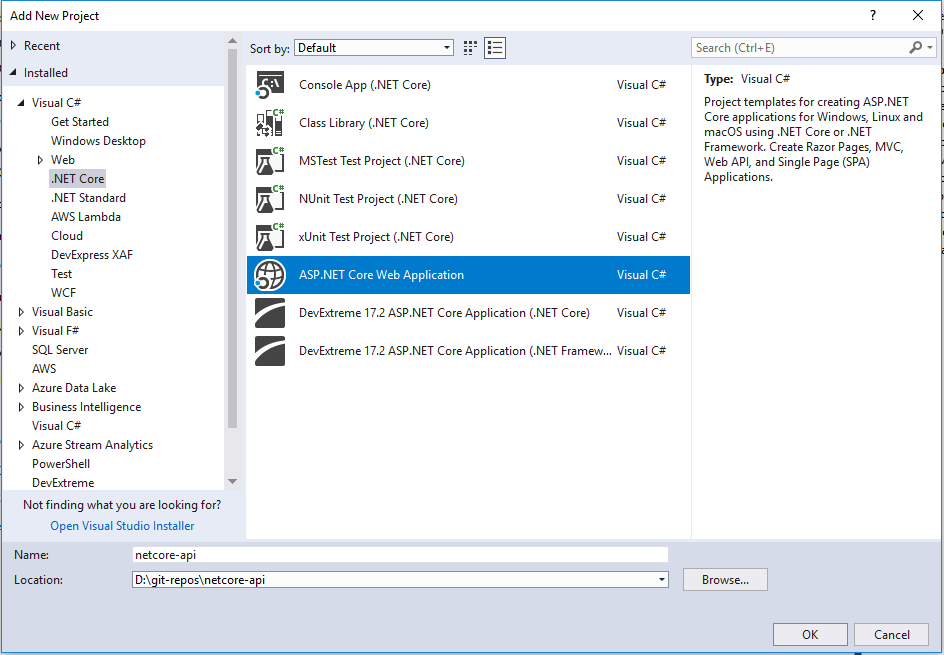

### Add a xUnit Test Project to solution

Next, Add a xUnit Test Project to solution and add couple of test to it. This
will be integrated with CI/CD. If you look and the project templates you can see
other test templates like MSTest and NUnit. **xUnit** is pretty lean compared
to **NUnit** and MsTest and has been written more recently. The .NET framework
has evolved since **NUnit**was first created.**XUnit** leverage some of the new
features to help developers write cleaner test, as tests should be kept clean
and treated as first-class citizens.follow this [link
](https://docs.microsoft.com/en-us/dotnet/standard/microservices-architecture/multi-container-microservice-net-applications/test-aspnet-core-services-web-apps)for
more info.

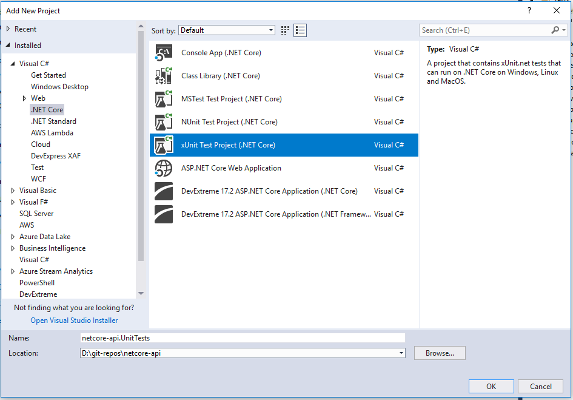

### Add Azure Web App

Next, Login to Azure portal -\> App Service -\> Web Application. And Create a
Web App where the above .NET Core application will be deployed. Select .NET Core
2.2 as runtime stack.

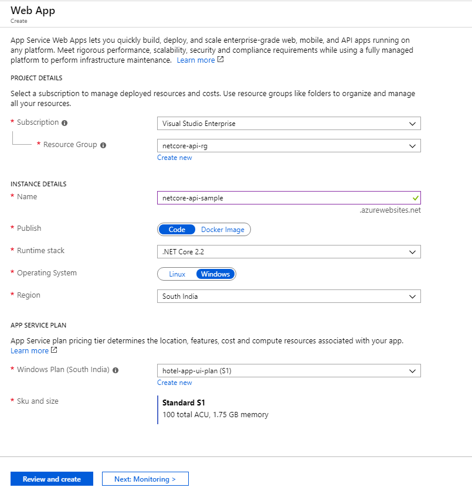

### Create New Azure DevOps project

Create Azure devOps project in your Organization. Reference link
<https://dev.azure.com/ManavSoft/>

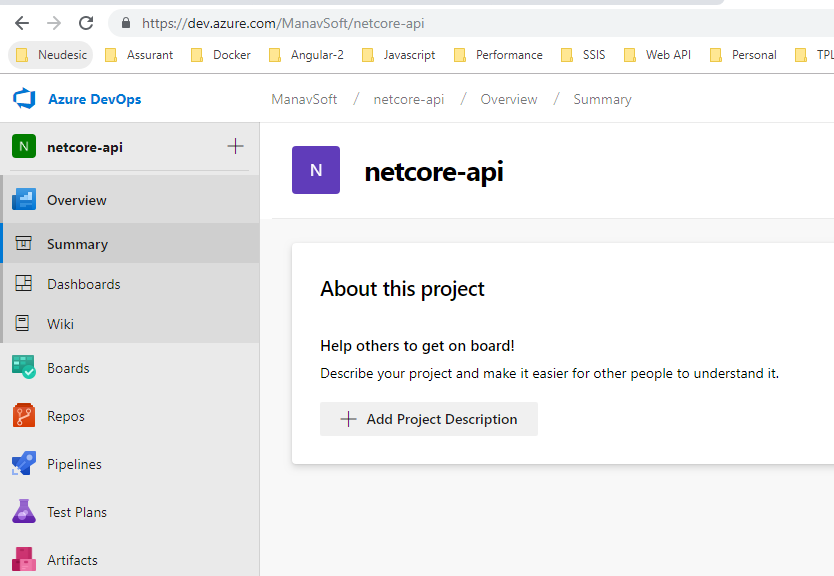

### Configure CI/CD Pipeline:

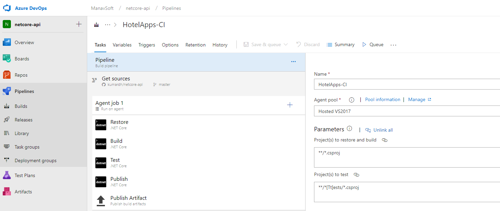

### Configure Builds pipeline

**Repository** 

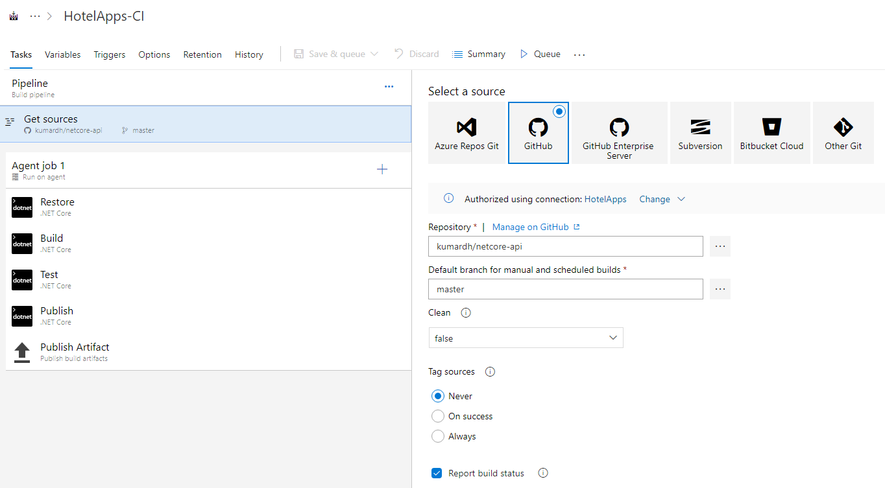

**Agent job** 

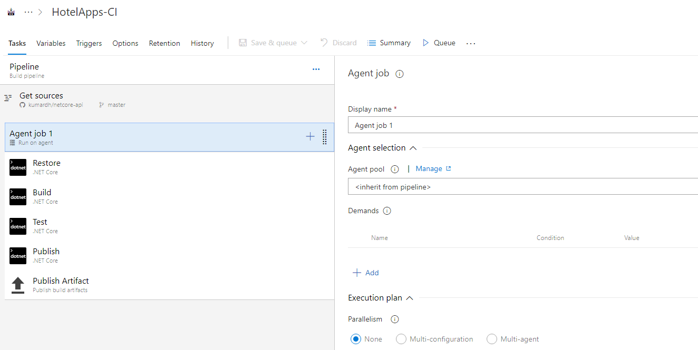

**Add Restore task**

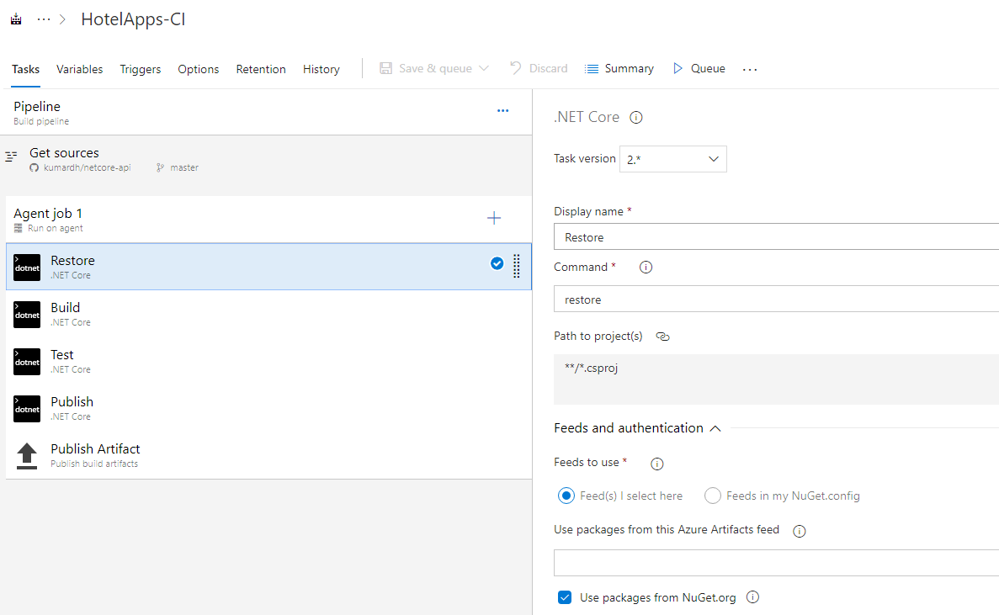

**Add Build task**

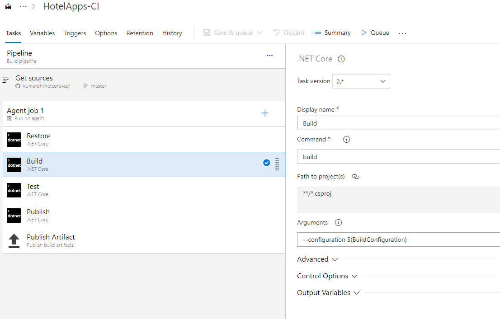

**Add Test task**

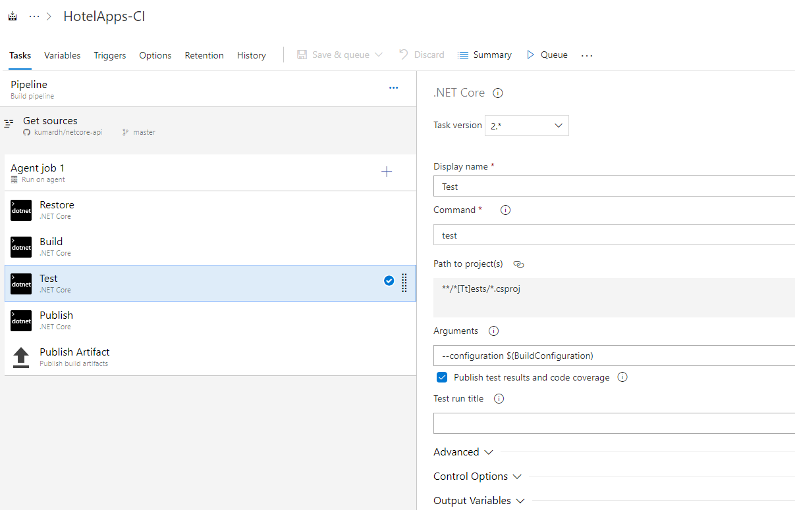

**Add Publish task**

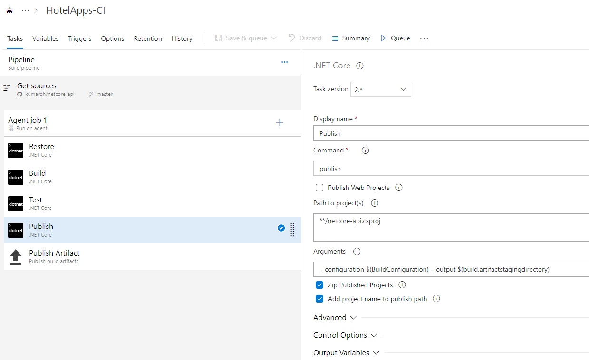

**Publish Artifact**

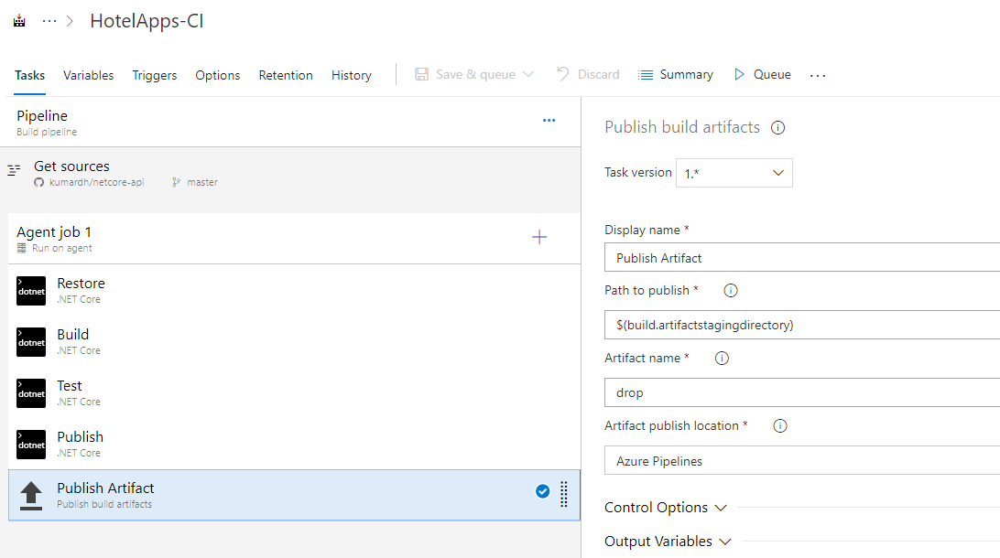

### Configure Release pipeline**

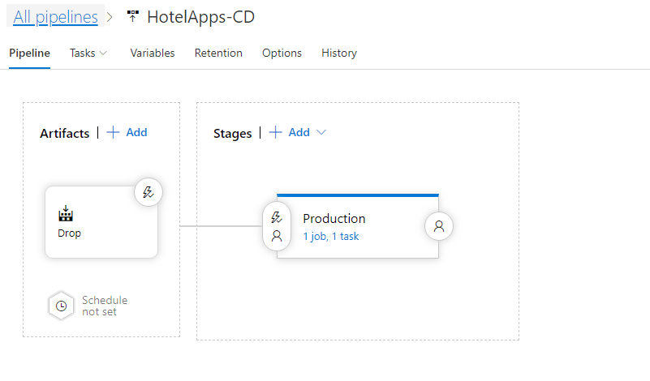

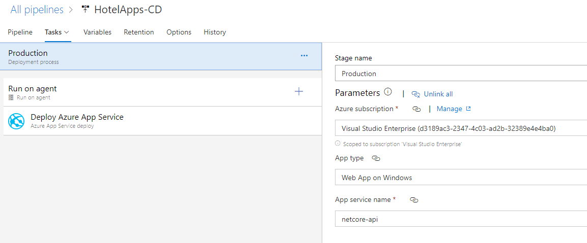

**Deploy Azure App**

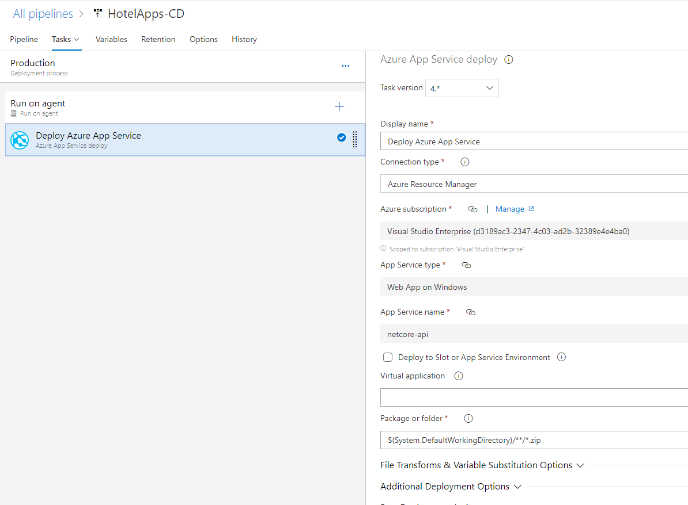

## Test Web Api 

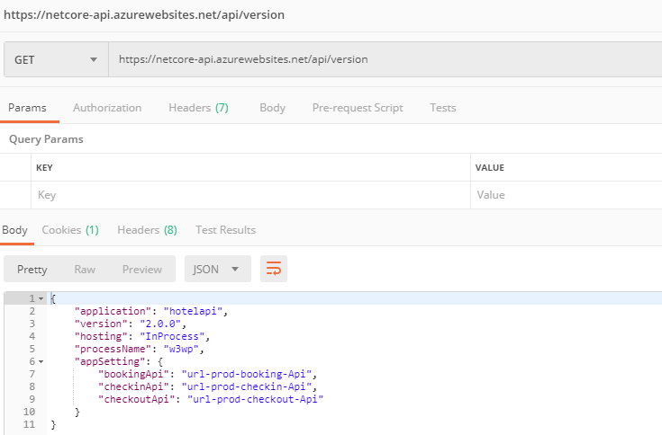
